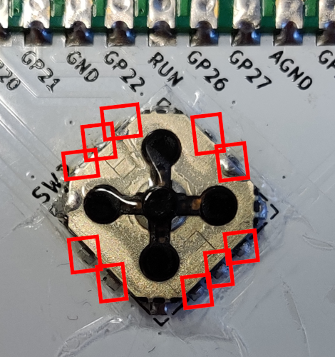
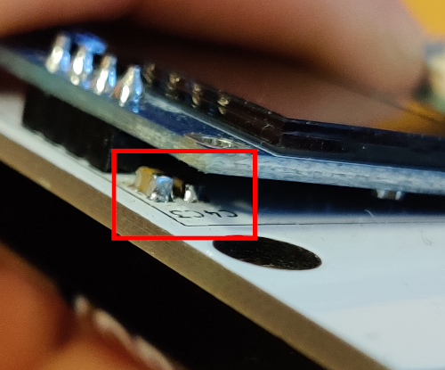
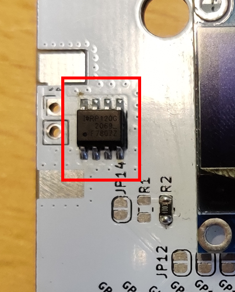
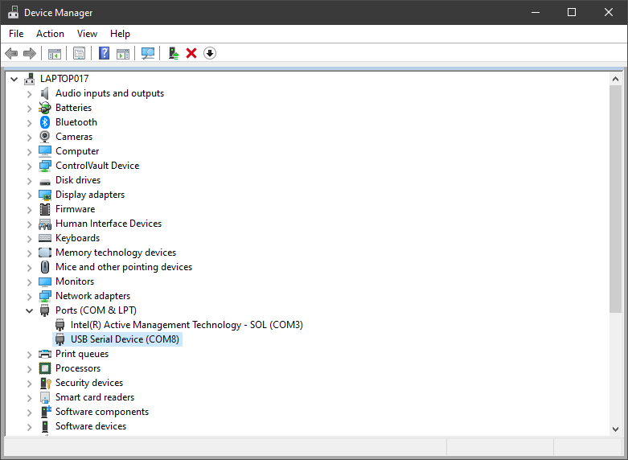
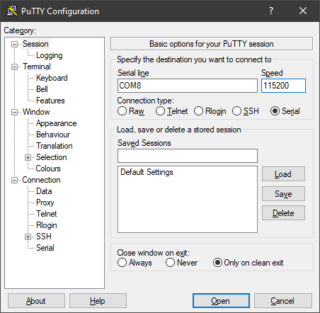
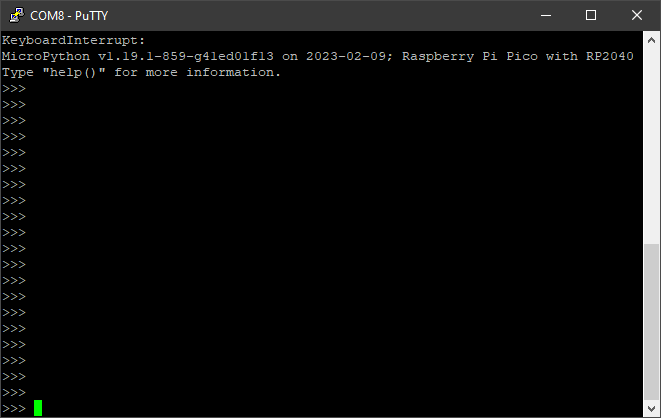

# Riscufefe \#5 badge repo

Some howto’s below.

# Hardware DIY instructions

## Minimal badge functionality

To get minimal badge functionality:

1.  Attach the screen to the front:

<table style="width:50%;">
<colgroup>
<col style="width: 50%" />
</colgroup>
<tbody>
<tr class="odd">
<td style="text-align: center;">

</td>
</tr>
</tbody>
</table>

2.  Attach the AAA battery holder to the back:

<table style="width:50%;">
<colgroup>
<col style="width: 50%" />
</colgroup>
<tbody>
<tr class="odd">
<td style="text-align: center;">

 

</td>
</tr>
</tbody>
</table>

3.  To protect your PICO from having battery and USB power at the same
    time, solder Q1:

<figure>

<figcaption aria-hidden="true">TODO PICTURE</figcaption>
</figure>

4.  To be able to switch off the batteries, solder SW1:

<table style="width:50%;">
<colgroup>
<col style="width: 50%" />
</colgroup>
<tbody>
<tr class="odd">
<td style="text-align: center;">

</td>
</tr>
</tbody>
</table>

5.  Insert 2xAAA batteries:

<figure>

<figcaption aria-hidden="true">TODO PICTURE</figcaption>
</figure>

You should now be able to see stuff on the screen, and you can interact
over USB / serial.

## Button controls

To control the badge with the button:

1.  Solder the 10 (3, 2, 3, 2) points of the button at SW1:

You should now be able to use the botton.

## GLITCHIFIER9000

To add GLITCHIFIER9000 functionality:

1.  Solder R2

2.  Solder C3, C4

2.  Solder unlabeled SOT8 MOSFET:

# Talk to the badge over USB

1.  Plug in micro-usb cable.

## On Windows

1.  Install a program to talk serial, like
    [putty](https://www.chiark.greenend.org.uk/~sgtatham/putty/latest.html)

2.  Find the COM port that pops up when you plug in the USB cable in
    device manager

3.  Set up that COM port with speed 115200

4.  Type some buttons, see what happens (also try CTRL+C and CTRL+D)

## On Linux

1.  You probably know yourself

# Set up badge firmware on a plain Raspberry Pi Pico

Set up PICO for badge

1.  Set up micropython firmware

    - Boot RPI into bootloader mode (hold BOOTSEL button and plug in
      USB)
    - Copy micropython `uf2` file to storage device (download yourself
      or located in `firmware/upython/rp2-firmware/rp2-pico-latest.uf2`)

2.  Copy firmware folder to device, for example with
    [`mpytool`](https://github.com/pavelrevak/mpytool)

    - `mpytool -p SERIALPORT put firmware/upython/badge/`

To do stuff over serial, connect with `SERIALPORT`, baudrate 115200.
